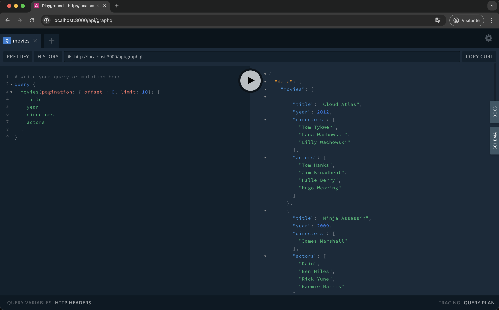

<h1 align="center">🎬 MoviesApp - Back-End</h1>

  <strong>🇧🇷 Português</strong>

 
<h2>✨ Sobre o Projeto</h2>

Este é um projeto <strong>backend</strong> desenvolvido com <strong>NestJS</strong>, que permite a consulta de dados de filmes, atores e diretores através de uma API <strong>GraphQL</strong>. Os dados são obtidos a partir de uma base já existente no <a href="https://sandbox.neo4j.com/?usecase=recommendations" target="_blank">Neo4j Sandbox</a> utilizando o modelo "Movies" por meio de queries <strong>GraphQL</strong>, oferecendo uma API completa para consultas e relações entre essas entidades.

O acesso à API é facilitado por um playground interativo (Apollo Server), permitindo exploração dinâmica dos dados.

A API foi desenvolvida com foco em boas práticas, seguindo os princípios e padrões recomendados pelo <strong>NestJS</strong>. Ela é ideal para estudos de GraphQL, integração com bancos de grafos e arquitetura modular de aplicações backend.

 
<h2>🧰 Tecnologias Utilizadas</h2>
<ul>
  <li><strong>NestJS</strong> - Estrutura principal da aplicação</li>
  <li><strong>GraphQL + Apollo Server</strong> - Para a construção da API</li>
  <li><strong>Neo4j</strong> - Banco de dados orientado a grafos</li>
  <li><strong>neo4j-driver</strong> - Conexão entre o backend e o Neo4j</li>
  <li><strong>class-validator / class-transformer</strong> - Validação e transformação de dados</li>
  <li><strong>dotenv + @nestjs/config</strong> - Gerenciamento de variáveis de ambiente</li>
</ul>

 
<h2>📁 Estrutura Geral</h2>

  O projeto segue a arquitetura modular recomendada pelo NestJS, separando responsabilidades em camadas bem definidas como: <code>resolver</code>, <code>service</code> e <code>repository</code>. Isso facilita a manutenção, testes e escalabilidade.

 
<h2>📚 Funcionalidades</h2>
<ul>
  <li>Consulta de filmes, atores e diretores através de GraphQL</li>
  <li>Paginação de resultados</li>
  <li>Integração em tempo real com base de dados Neo4j</li>
</ul>

 
<h2>⚙️ Instalação e Configuração</h2>
<ol>
  <li>Clone o repositório:</li>
  <pre><code>git clone https://github.com/SEU-USUARIO/moviesapp-backend.git</code></pre>
  <li>Instale as dependências:</li>
  <pre><code>npm install</code></pre>
  <li>
    Crie um arquivo <code>.env</code> na raiz do projeto com as seguintes variáveis de ambiente:
  </li>
<pre><code>
NEO4J_SCHEME=neo4j
NEO4J_HOST=xxxxxxx.databases.neo4j.io
NEO4J_PORT=7687
NEO4J_USERNAME=neo4j
NEO4J_PASSWORD=sua-senha
NEO4J_DATABASE=neo4j
NEO4J_SECURE=true
</code></pre>
  <li>
    As informações acima são obtidas ao criar um ambiente no 
    <a href="https://sandbox.neo4j.com/?usecase=recommendations" target="_blank">Neo4j Sandbox</a> com o modelo "Movies".

  

  </li>
  <li>Execute a aplicação localmente:</li>
  <pre><code>npm run start:dev</code></pre>
</ol>

 
<h2>📱 Demonstração</h2>
 

<h3 align="center">🚀 Playground GraphQL</h3>

  Após iniciar a aplicação, acesse <code>http://localhost:3000/api/graphql</code> para utilizar o playground GraphQL.

  

 
<h3 align="center">🛜 Insomnia</h3>

  Após iniciar a aplicação, utilize o insomnia ou outro software similar a sua escolha para fazer requisições a API

  

 
<h2>📎 Observações</h2>
<ul>
  <li>Este repositório representa apenas o backend do projeto.</li>
  <li>Para visualização dos dados, consulte o frontend: 
    <a href="https://github.com/herminio-rocha/moviesapp_frontend" target="_blank">
      moviesapp_frontend
    </a>.
  </li>
</ul>

 
<h2>📜 Licença</h2>

  Este projeto está licenciado sob a licença <a href="https://opensource.org/licenses/MIT" target="_blank"><strong>MIT</strong></a>. Isso significa que você tem a liberdade de usar, modificar e distribuir este projeto, desde que atribua os créditos apropriados e mantenha a mesma licença em trabalhos derivados.

 
<h2>📬 Entre em Contato</h2>

  Ficarei feliz em receber feedbacks, esclarecer dúvidas, me conectar ou apenas bater um papo. Fique à vontade para entrar em contato:

<ul>
  <li><strong>E-mail:</strong> <a href="mailto:herminio.rocha@outlook.com.br">herminio.rocha@outlook.com.br</a></li>
  <li><strong>LinkedIn:</strong> <a href="https://www.linkedin.com/in/herminio-rocha-9325a2137" target="_blank">Herminio Rocha</a></li>
</ul>

 
<h2></h2>

<em>Obrigado por visitar este projeto! Espero que seja útil para você e inspire novos aprendizados.</em>

<em>Jesus abençoe a todos 🙏</em>

<h2></h2>
 

  <strong>🇺🇸 English</strong>

 
<h2>✨ About the Project</h2>

This is a <strong>backend</strong> project built with <strong>NestJS</strong> that enables querying data about movies, actors, and directors through a <strong>GraphQL API</strong>. The data is retrieved from an existing <a href="https://sandbox.neo4j.com/?usecase=recommendations" target="_blank">Neo4j Sandbox</a> instance using the "Movies" model via <strong>GraphQL</strong> queries, offering a complete API for exploring and relating these entities.

Access to the API is facilitated by an interactive playground (Apollo Server), allowing dynamic exploration of the data.

The API was developed following best practices and the standards recommended by the NestJS framework. It's ideal for learning GraphQL, integrating with graph databases, and applying a modular architecture in backend applications.

 
<h2>🧰 Technologies Used</h2>
<ul>
  <li><strong>NestJS</strong> - Main framework of the application</li>
  <li><strong>GraphQL + Apollo Server</strong> - For building the API</li>
  <li><strong>Neo4j</strong> - Graph-based database</li>
  <li><strong>neo4j-driver</strong> - Connects the backend to the Neo4j database </li>
  <li><strong>class-validator / class-transformer</strong> - For data validation and transformation </li>
  <li><strong>dotenv + @nestjs/config</strong> - Environment variable management
  </li>
</ul>

 
<h2>📁 General Structure</h2>

  The project follows the modular architecture recommended by NestJS, separating responsibilities into clearly defined layers such as resolvers, services, and repositories. This structure facilitates maintenance, testing, and scalability.

 
<h2>📚 Features</h2>
<ul>
  <li>Query movies, actors, and directors via GraphQL</li>
  <li>Paginated results</li>
  <li>Real-time integration with a Neo4j database</li>
</ul>

 
<h2>⚙️ Installation and Setup</h2>
<ol>
  <li>Clone the repository:</li>
  <pre><code>git clone https://github.com/SEU-USUARIO/moviesapp-backend.git</code></pre>
  <li>Install dependencies:</li>
  <pre><code>npm install</code></pre>
  <li>
    Create a <code>.env</code> file in the root directory with the following environment variables:
  </li>
<pre><code>
NEO4J_SCHEME=neo4j
NEO4J_HOST=xxxxxxx.databases.neo4j.io
NEO4J_PORT=7687
NEO4J_USERNAME=neo4j
NEO4J_PASSWORD=sua-senha
NEO4J_DATABASE=neo4j
NEO4J_SECURE=true
</code></pre>
  <li>
    You can get this information by setting up a "Movies" project in the
    <a href="https://sandbox.neo4j.com/?usecase=recommendations" target="_blank">Neo4j Sandbox</a>

  

  </li>
  <li>Run the application locally:</li>
  <pre><code>npm run start:dev</code></pre>
</ol>

 
<h2>📱 Demo</h2>
 

<h3 align="center">🚀 GraphQL Playground</h3>

  After starting the application, access: <code>http://localhost:3000/api/graphql</code> to use the GraphQL Playground.

  

 
<h3 align="center">🛜 Insomnia</h3>

  Once the application is running, you can use Insomnia or a similar tool of your choice to send requests to the API.

  

 
<h2>📎 Notes</h2>
<ul>
  <li>This repository represents the backend only.</li>
  <li>To visualize the data, please check out the frontend:
    <a href="https://github.com/herminio-rocha/moviesapp_frontend" target="_blank">
      moviesapp_frontend
    </a>.
  </li>
</ul>

 
<h2>📜 License</h2>

This project is licensed under the <a href="https://opensource.org/licenses/MIT" target="_blank"><strong>MIT License</strong></a>. This means you are free to use, modify, and distribute this project as long as you provide appropriate credit and retain the same license for derivative works.

 
<h2>📬 Get in Touch</h2>

  I’m happy to receive feedback, answer questions, connect, or just have a friendly chat. Feel free to reach out:

<ul>
  <li><strong>E-mail:</strong> <a href="mailto:herminio.rocha@outlook.com.br">herminio.rocha@outlook.com.br</a></li>
  <li><strong>LinkedIn:</strong> <a href="https://www.linkedin.com/in/herminio-rocha-9325a2137" target="_blank">Herminio Rocha</a></li>
</ul>

 
<h2></h2>

<em>Thanks for visiting this project! I hope it’s useful and inspires new learning.</em>

<em>🙠May Jesus bless you all.</em>

<h2></h2>
 

